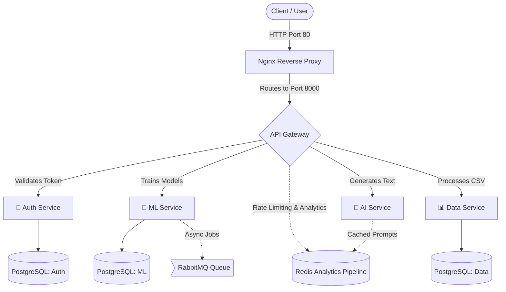

# AI Microservices Platform & Developer Hub

Welcome to the **AI Microservices Platform**! This repository is a monolithic ecosystem containing a highly optimized AI API backend cluster and a beautiful Next.js self-service Developer Portal.

---

# 🚀 AI Platform Architecture Deep Dive (Backend)

> A comprehensive guide to understanding the microservices architecture, Docker orchestration, design patterns, and key concepts learned from each configuration file.

## 🏗️ High-Level System Workflow



## 🔑 Service-Scoped API Keys & Analytics
The backend architecture integrates natively with the frontend **Developer Hub**. 
- **Isolated Service Scopes**: The API Gateway actively intercepts the `X-API-Key` headers on all reverse proxies. It natively identifies if a token belongs to `ML`, `AI`, `Data`, or `All` and immediately blocks (`403 Forbidden`) cross-service access attempts.
- **High-Performance Redis Telemetry**: The `rate_limiter.py` middleware tracks absolute cumulative system load natively into `Redis`, isolating sliding 1-hour quotas and absolute lifetime analytics specifically to the isolated `key_id` level.

---

## 📋 Book Chapters

| Chapter | Description | Link |
| :---: | :--- | :---: |
| 1 | 🏗️ docker-compose.yml | [Read](ai_api_platform/docs/01-docker-orchestration.md) |
| 2 | 🤖 ML Service | [Read](ai_api_platform/docs/02-ml-service.md) |
| 3 | 🗺️ Full Service Architecture Map | [Read](ai_api_platform/docs/03-architecture.md) |
| 4 | 📈 Production Deployment Architecture | [Read](ai_api_platform/docs/04-deployment.md) |
| 5 | 📚 Key Concepts Summary | [Read](ai_api_platform/docs/05-concepts.md) |
| 6 | 🔧 Quick Reference | [Read](ai_api_platform/docs/06-quick-reference.md) |
| 7 | 🚪 Gateway Service | [Read](ai_api_platform/docs/07-gateway-service.md) |
| 8 | 🔐 Auth Service | [Read](ai_api_platform/docs/08-auth-service.md) |
| 9 | 🧠 AI Service | [Read](ai_api_platform/docs/10-ai-service.md) |
| 10 | 📊 Data Service | [Read](ai_api_platform/docs/09-data-service.md) |
| 11 | 🛠️ Dockerfiles & Containerization | [Read](ai_api_platform/docs/chapter_dockerfiles---containerization.md) |
| 12 | 🎨 Nginx Configuration Design | [Read](ai_api_platform/docs/chapter_nginx-configuration-design.md) |
| 13 | 🎯 Design Patterns Used | [Read](ai_api_platform/docs/chapter_design-patterns-used.md) |
| 14 | 📈 Complete System Workflow Diagram | [Read](ai_api_platform/docs/chapter_complete-system-workflow-diagram.md) |
| 15 | 🏛️ Overall Architecture Diagram | [Read](ai_api_platform/docs/chapter_overall-architecture-diagram.md) |
| 16 | 📋 Service Communication Map | [Read](ai_api_platform/docs/chapter_service-communication-map.md) |
| 17 | 🔐 Security Layers | [Read](ai_api_platform/docs/chapter_security-layers.md) |
| 18 | 📊 Data Models | [Read](ai_api_platform/docs/chapter_data-models.md) |
| 19 | 🚀 Quick Start Guide | [Read](ai_api_platform/docs/chapter_quick-start-guide.md) |
| 20 | 🎓 Key Takeaways | [Read](ai_api_platform/docs/chapter_key-takeaways.md)

*All docs paths above map to `ai_api_platform/docs/`.*

---
---

# AI Developer Portal (Frontend)

This is the official Next.js 15 (App Router) Developer Hub for the AI Microservices Platform, wrapped in a customized **Space Blue Glassmorphism** Tailwind CSS v4 design system.

## 🌟 Core Features

- **Service-Scoped Keys**: Students and developers can generate specialized API keys locked explicitly to specific microservices (e.g. `Machine Learning Jobs Only` or `Data Processing Engine`).
- **Real-Time Bandwidth Analytics**: The dashboard interfaces directly with the backend API Gateway's Redis pipeline to display live visual gauges of API Key usage (Hourly limit vs. Lifetime hits).
- **Interactive Documentation**: Auto-generating `cURL` commands for the AI, ML, and Data microservices seamlessly powered by the user's generated active Bearer tokens.
- **Secure Sub-Routing**: Native Next.js API interceptors detect orphaned or dead `401 Unauthorized` sessions, instantly wiping local cache and cleanly redirecting to the login flow.

## 🛠️ Technology Stack
- **Framework**: Next.js 15 (React 19)
- **Styling**: Tailwind CSS v4
- **Language**: TypeScript
- **Auth**: JWT (Bearer Tokens) + LocalStorage
- **Animations**: Tailwind `animate-in`, native smooth drops.

## 🚀 Getting Started

### 1. Requirements
Ensure the Python API Gateway backend is actively running on `localhost:8000`.

### 2. Installation
Navigate to the `frontend` directory and install pure Node packages:

```bash
cd frontend
npm install
```

### 3. Launch Development Server
```bash
npm run dev
```

Navigate your browser to [http://localhost:3000](http://localhost:3000). If you haven't yet, follow the "Get Started" prompt to hit the Auth-Service and securely register a new User Account in PostgreSQL!
